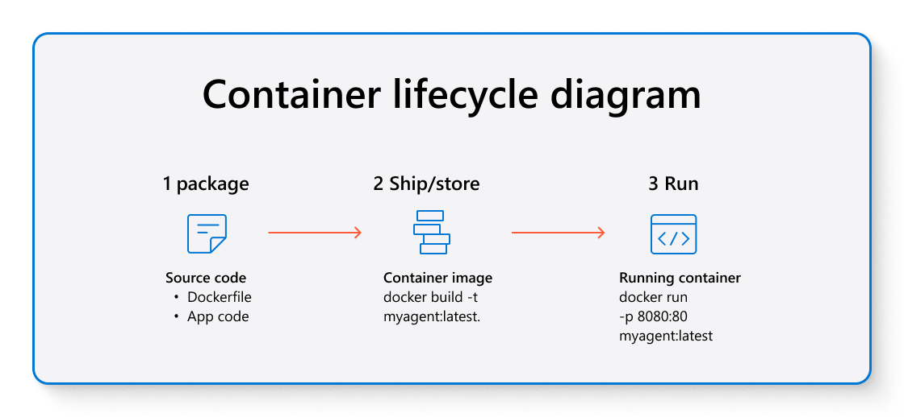
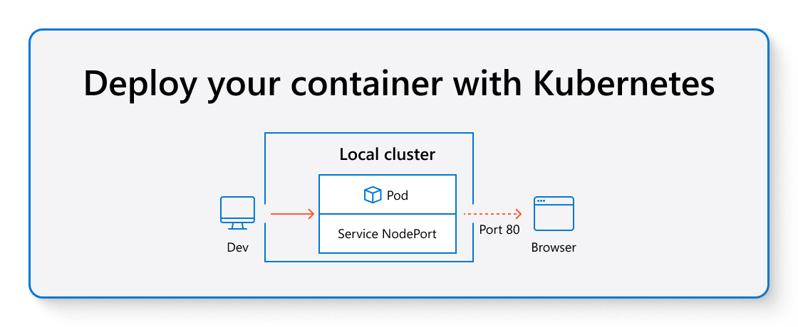
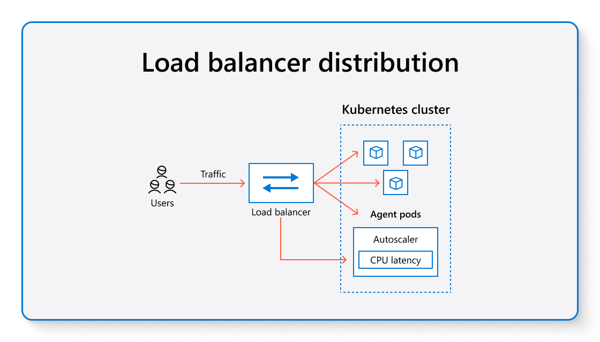
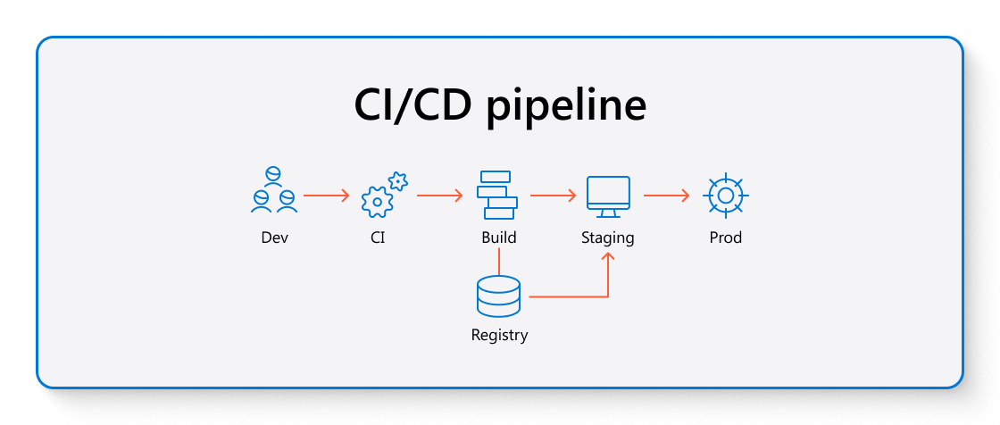

## Activity: Container-based deployment pipeline
## Project scenario
You work for a global customer support company that provides 24/7 assistance to clients around the world. To meet growing client demands, the company employs an automated team of digital support agents responsible for handling incoming service requests. As your company expands into new regions, the support system must adapt to efficiently direct different types of requests—including technical issues, account questions, and urgent service outages—to the most suitable digital agent. You are tasked with designing a request routing system that intelligently matches incoming requests to agents based on their expertise and availability, uses fair distribution methods (such as skill-based routing or load balancing), and promptly escalates critical requests to ensure rapid response. System monitoring and simulation runs will help demonstrate that your solution works reliably for both everyday operations and high-priority situations.

## Objective
The goal of this activity is to design and simulate an Intelligent Request Routing System for a global digital support operation. In this hands-on project, you will build a system that automatically assigns customer requests to the best-matched support agent based on their specialized skills and current workload, aiming to improve response times and service quality. By the end of the activity, you will be able to evaluate how intelligent request routing optimizes agent utilization, reduces response delays, avoids overload, and ensures that urgent customer needs are prioritized.

## Instructions
### Step 1: Build your agent container

Example code:
# Use an official Python runtime as a parent image
FROM python:3.9-slim-buster
# Set the working directory in the container
WORKDIR /app
# Copy the requirements file into the container
COPY requirements.txt .
# Install any needed packages specified in requirements.txt
RUN pip install --no-cache-dir -r requirements.txt
# Copy the rest of the application code into the container
COPY . .
# Expose port 8000 for the application
EXPOSE 8000
# Define the command to run the application
CMD ["python", "app.py"]

1. Review your provided Dockerfile. The Dockerfile is a text document that has all the commands to assemble your image.

Tip: Look for commands like FROM, COPY, and CMD.

2. Open a terminal and navigate to your agent’s source code folder.

3. Build the container image:

 docker build -t myagent:latest .  

4. Run your agent container:  

 docker run -d -p 8080:80 myagent:latest  

 5. Check if your container is running:  

 docker ps  

 Tip: The "PORTS" column shows where your container is reachable.

Common troubleshooting:
If the container exits, check your Dockerfile for a 'CMD' or 'ENTRYPOINT' definition.

Make sure files and folders are referenced correctly.

### Step 2: Deploy your container with Kubernetes

1. Start your local cluster using Minikube or kind.

Example (Minikube): minikube start

Example (kind): kind create cluster

Minikube and kind are programs that let you run Kubernetes for testing on your own machine.

2. Prepare your Kubernetes deployment. Create a deployment.yaml (provided in your resources), and edit these fields:

image: myagent:latest (or relevant image name).

ports: set to match your agent’s port.

3. Deploy to Kubernetes:

 kubectl apply -f deployment.yaml  

4. Expose your agent as a service:  

 kubectl expose deployment myagent --type=NodePort --port=80  

5.  Check pod and service status:  

kubectl get pods
kubectl get services

Troubleshooting tips
Use kubectl describe pod [name] to see error details.

Validate your YAML file using an online linter if errors appear.

### Step 3: Explore production requirements

1. Review these production terms:

Load balancing: Distributes user traffic across containers.

Auto-scaling: Adds or removes containers based on demand.

Network/security policies: Rules that control which resources can connect.

2. Use your browser to research how Kubernetes LoadBalancer services and Horizontal Pod Autoscaler work.

3. List two changes you would make for a production setting that go beyond your local setup.

### Step 4: Intro to CI/CD Pipelines

Open the provided GitHub Actions workflow YAML.

CI/CD stands for Continuous Integration / Continuous Deployment, a way to automatically test and deploy changes.

Make a small edit in your agent’s code or documentation and commit the change.

Watch as the workflow automatically builds and tests your container. Observe notifications or logs in your repository.

### Step 5: Monitor and Troubleshoot
1. View container logs with:  

docker logs [container_id]

kubectl logs [pod_name] 

2. Look for repeated errors or warnings.

3. Practice stopping and restarting your container or pod:

kubectl delete pod [pod_name]

     kubectl get pods  

